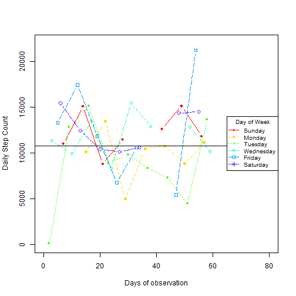
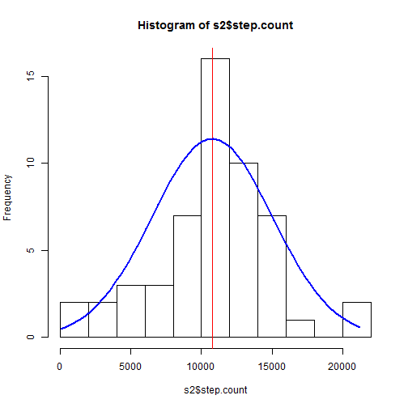
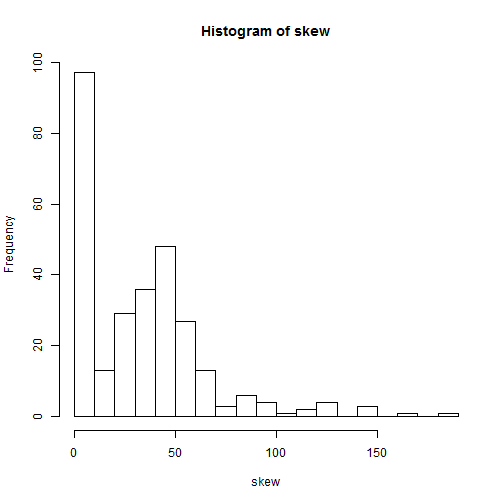
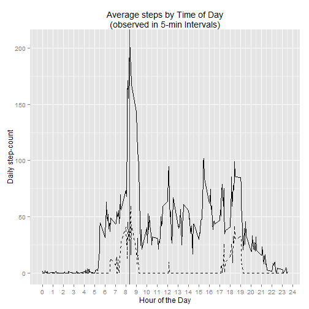
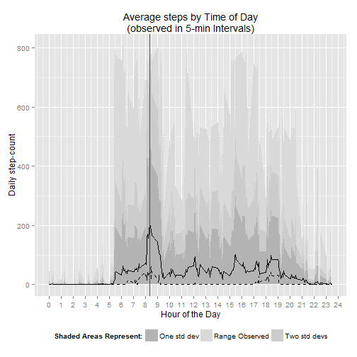
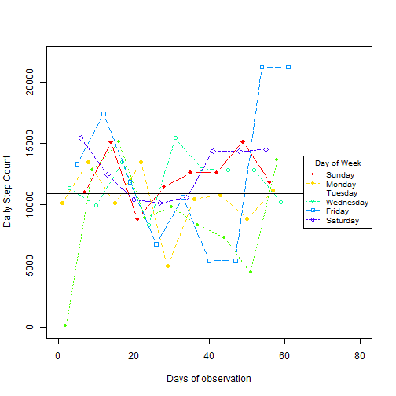
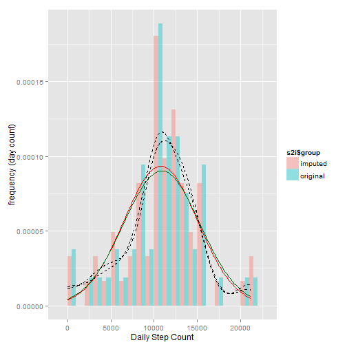
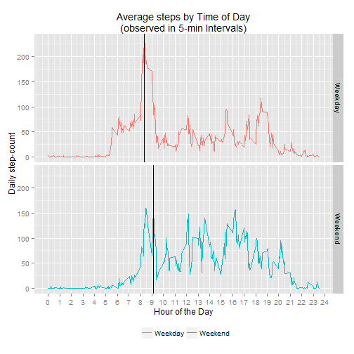

# Overview

This is the first assigned project towards completion of the Coursera "Reproducible Research" - October 2015. 

According to the assignent page:

<em>"This assignment makes use of data from a personal activity monitoring device. This device collects data at 5 minute intervals through out the day. The data consists of two months of data from an anonymous individual collected during the months of October and November, 2012 and include the number of steps taken in 5 minute intervals each day."
</em>

# The Data

The Activity monitoring dataset includes 17,568 observations and is in a csv format downloaded from URL:
http://d396qusza40orc.cloudfront.net/repdata%2Fdata%2Factivity.zip 

There are three column variables whose definitions are repeated below:

* **steps:** Number of steps taking in a 5-minute interval (missing values are coded as NA)


* **date:** The date on which the measurement was taken in YYYY-MM-DD format


* **interval:** Identifier for the 5-minute interval in which measurement was taken. The identifier is an integer formed by concatenating the 24-hour with a two-digit minute marking the beginning of the time interval 

Here are a summary of the raw data:


```r
setwd("D:/Coursera/work/R5-ReproducibleResearch/Project1")
raw.data <- read.csv("data/activity.csv")
summary(raw.data)
```

```
##      steps                date          interval     
##  Min.   :  0.00   2012-10-01:  288   Min.   :   0.0  
##  1st Qu.:  0.00   2012-10-02:  288   1st Qu.: 588.8  
##  Median :  0.00   2012-10-03:  288   Median :1177.5  
##  Mean   : 37.38   2012-10-04:  288   Mean   :1177.5  
##  3rd Qu.: 12.00   2012-10-05:  288   3rd Qu.:1766.2  
##  Max.   :806.00   2012-10-06:  288   Max.   :2355.0  
##  NA's   :2304     (Other)   :15840
```

We add a real date to make date manipulation easier. We could replace the existing date but since we are using *xtable* we chose to retain the character version of the date. After adding the day of week to understand weekly paterns of observations, the data frame "data" looks like this...


```r
dow<-c("Sunday","Monday","Tuesday","Wednesday","Friday","Saturday")
data<-raw.data
data$dt<-as.Date(raw.data$date)
data$day<-weekdays(data$dt)
data$weekend<-data$day %in% c("Saturday","Sunday")
tail(head(data,1444))
```

```
##      steps       date interval         dt      day weekend
## 1439     0 2012-10-05     2350 2012-10-05   Friday   FALSE
## 1440     0 2012-10-05     2355 2012-10-05   Friday   FALSE
## 1441     0 2012-10-06        0 2012-10-06 Saturday    TRUE
## 1442     0 2012-10-06        5 2012-10-06 Saturday    TRUE
## 1443     0 2012-10-06       10 2012-10-06 Saturday    TRUE
## 1444     0 2012-10-06       15 2012-10-06 Saturday    TRUE
```
... and a few more rows with non-zero step values:

```r
tail(head(data,1544))
```

```
##      steps       date interval         dt      day weekend
## 1539   321 2012-10-06      810 2012-10-06 Saturday    TRUE
## 1540   149 2012-10-06      815 2012-10-06 Saturday    TRUE
## 1541     0 2012-10-06      820 2012-10-06 Saturday    TRUE
## 1542    82 2012-10-06      825 2012-10-06 Saturday    TRUE
## 1543    94 2012-10-06      830 2012-10-06 Saturday    TRUE
## 1544   225 2012-10-06      835 2012-10-06 Saturday    TRUE
```

Summarizing by day we can look at the count and range of intervals, and find out count observations (how many are non-NA and how many are more than Zero)  


```r
s1<- data %>% 
  group_by(date,day,dt) %>% 
  summarize(from.interval=min(interval),
            to.interval=max(interval),
            count=sum(interval==interval),
            valid.observations=sum(!is.na(steps)),
            nonZero.observations=sum(steps>0,na.rm=TRUE)) 
```


```r
library(xtable)
print(xtable(s1),type = "html")
```

```
## Warning in formatC(x = structure(c(15614, 15615, 15616, 15617, 15618,
## 15619, : class of 'x' was discarded
```

<!-- html table generated in R 3.2.2 by xtable 1.7-4 package -->
<!-- Sun Oct 11 14:35:16 2015 -->
<table border=1>
<tr> <th>  </th> <th> date </th> <th> day </th> <th> dt </th> <th> from.interval </th> <th> to.interval </th> <th> count </th> <th> valid.observations </th> <th> nonZero.observations </th>  </tr>
  <tr> <td align="right"> 1 </td> <td> 2012-10-01 </td> <td> Monday </td> <td align="right"> 15614.00 </td> <td align="right">   0 </td> <td align="right"> 2355 </td> <td align="right"> 288 </td> <td align="right">   0 </td> <td align="right">   0 </td> </tr>
  <tr> <td align="right"> 2 </td> <td> 2012-10-02 </td> <td> Tuesday </td> <td align="right"> 15615.00 </td> <td align="right">   0 </td> <td align="right"> 2355 </td> <td align="right"> 288 </td> <td align="right"> 288 </td> <td align="right">   2 </td> </tr>
  <tr> <td align="right"> 3 </td> <td> 2012-10-03 </td> <td> Wednesday </td> <td align="right"> 15616.00 </td> <td align="right">   0 </td> <td align="right"> 2355 </td> <td align="right"> 288 </td> <td align="right"> 288 </td> <td align="right">  81 </td> </tr>
  <tr> <td align="right"> 4 </td> <td> 2012-10-04 </td> <td> Thursday </td> <td align="right"> 15617.00 </td> <td align="right">   0 </td> <td align="right"> 2355 </td> <td align="right"> 288 </td> <td align="right"> 288 </td> <td align="right"> 100 </td> </tr>
  <tr> <td align="right"> 5 </td> <td> 2012-10-05 </td> <td> Friday </td> <td align="right"> 15618.00 </td> <td align="right">   0 </td> <td align="right"> 2355 </td> <td align="right"> 288 </td> <td align="right"> 288 </td> <td align="right">  86 </td> </tr>
  <tr> <td align="right"> 6 </td> <td> 2012-10-06 </td> <td> Saturday </td> <td align="right"> 15619.00 </td> <td align="right">   0 </td> <td align="right"> 2355 </td> <td align="right"> 288 </td> <td align="right"> 288 </td> <td align="right"> 106 </td> </tr>
  <tr> <td align="right"> 7 </td> <td> 2012-10-07 </td> <td> Sunday </td> <td align="right"> 15620.00 </td> <td align="right">   0 </td> <td align="right"> 2355 </td> <td align="right"> 288 </td> <td align="right"> 288 </td> <td align="right"> 108 </td> </tr>
  <tr> <td align="right"> 8 </td> <td> 2012-10-08 </td> <td> Monday </td> <td align="right"> 15621.00 </td> <td align="right">   0 </td> <td align="right"> 2355 </td> <td align="right"> 288 </td> <td align="right">   0 </td> <td align="right">   0 </td> </tr>
  <tr> <td align="right"> 9 </td> <td> 2012-10-09 </td> <td> Tuesday </td> <td align="right"> 15622.00 </td> <td align="right">   0 </td> <td align="right"> 2355 </td> <td align="right"> 288 </td> <td align="right"> 288 </td> <td align="right">  95 </td> </tr>
  <tr> <td align="right"> 10 </td> <td> 2012-10-10 </td> <td> Wednesday </td> <td align="right"> 15623.00 </td> <td align="right">   0 </td> <td align="right"> 2355 </td> <td align="right"> 288 </td> <td align="right"> 288 </td> <td align="right"> 104 </td> </tr>
  <tr> <td align="right"> 11 </td> <td> 2012-10-11 </td> <td> Thursday </td> <td align="right"> 15624.00 </td> <td align="right">   0 </td> <td align="right"> 2355 </td> <td align="right"> 288 </td> <td align="right"> 288 </td> <td align="right">  75 </td> </tr>
  <tr> <td align="right"> 12 </td> <td> 2012-10-12 </td> <td> Friday </td> <td align="right"> 15625.00 </td> <td align="right">   0 </td> <td align="right"> 2355 </td> <td align="right"> 288 </td> <td align="right"> 288 </td> <td align="right"> 111 </td> </tr>
  <tr> <td align="right"> 13 </td> <td> 2012-10-13 </td> <td> Saturday </td> <td align="right"> 15626.00 </td> <td align="right">   0 </td> <td align="right"> 2355 </td> <td align="right"> 288 </td> <td align="right"> 288 </td> <td align="right"> 104 </td> </tr>
  <tr> <td align="right"> 14 </td> <td> 2012-10-14 </td> <td> Sunday </td> <td align="right"> 15627.00 </td> <td align="right">   0 </td> <td align="right"> 2355 </td> <td align="right"> 288 </td> <td align="right"> 288 </td> <td align="right">  94 </td> </tr>
  <tr> <td align="right"> 15 </td> <td> 2012-10-15 </td> <td> Monday </td> <td align="right"> 15628.00 </td> <td align="right">   0 </td> <td align="right"> 2355 </td> <td align="right"> 288 </td> <td align="right"> 288 </td> <td align="right">  77 </td> </tr>
  <tr> <td align="right"> 16 </td> <td> 2012-10-16 </td> <td> Tuesday </td> <td align="right"> 15629.00 </td> <td align="right">   0 </td> <td align="right"> 2355 </td> <td align="right"> 288 </td> <td align="right"> 288 </td> <td align="right">  96 </td> </tr>
  <tr> <td align="right"> 17 </td> <td> 2012-10-17 </td> <td> Wednesday </td> <td align="right"> 15630.00 </td> <td align="right">   0 </td> <td align="right"> 2355 </td> <td align="right"> 288 </td> <td align="right"> 288 </td> <td align="right">  88 </td> </tr>
  <tr> <td align="right"> 18 </td> <td> 2012-10-18 </td> <td> Thursday </td> <td align="right"> 15631.00 </td> <td align="right">   0 </td> <td align="right"> 2355 </td> <td align="right"> 288 </td> <td align="right"> 288 </td> <td align="right">  66 </td> </tr>
  <tr> <td align="right"> 19 </td> <td> 2012-10-19 </td> <td> Friday </td> <td align="right"> 15632.00 </td> <td align="right">   0 </td> <td align="right"> 2355 </td> <td align="right"> 288 </td> <td align="right"> 288 </td> <td align="right">  93 </td> </tr>
  <tr> <td align="right"> 20 </td> <td> 2012-10-20 </td> <td> Saturday </td> <td align="right"> 15633.00 </td> <td align="right">   0 </td> <td align="right"> 2355 </td> <td align="right"> 288 </td> <td align="right"> 288 </td> <td align="right">  83 </td> </tr>
  <tr> <td align="right"> 21 </td> <td> 2012-10-21 </td> <td> Sunday </td> <td align="right"> 15634.00 </td> <td align="right">   0 </td> <td align="right"> 2355 </td> <td align="right"> 288 </td> <td align="right"> 288 </td> <td align="right">  91 </td> </tr>
  <tr> <td align="right"> 22 </td> <td> 2012-10-22 </td> <td> Monday </td> <td align="right"> 15635.00 </td> <td align="right">   0 </td> <td align="right"> 2355 </td> <td align="right"> 288 </td> <td align="right"> 288 </td> <td align="right">  87 </td> </tr>
  <tr> <td align="right"> 23 </td> <td> 2012-10-23 </td> <td> Tuesday </td> <td align="right"> 15636.00 </td> <td align="right">   0 </td> <td align="right"> 2355 </td> <td align="right"> 288 </td> <td align="right"> 288 </td> <td align="right">  88 </td> </tr>
  <tr> <td align="right"> 24 </td> <td> 2012-10-24 </td> <td> Wednesday </td> <td align="right"> 15637.00 </td> <td align="right">   0 </td> <td align="right"> 2355 </td> <td align="right"> 288 </td> <td align="right"> 288 </td> <td align="right">  80 </td> </tr>
  <tr> <td align="right"> 25 </td> <td> 2012-10-25 </td> <td> Thursday </td> <td align="right"> 15638.00 </td> <td align="right">   0 </td> <td align="right"> 2355 </td> <td align="right"> 288 </td> <td align="right"> 288 </td> <td align="right">  44 </td> </tr>
  <tr> <td align="right"> 26 </td> <td> 2012-10-26 </td> <td> Friday </td> <td align="right"> 15639.00 </td> <td align="right">   0 </td> <td align="right"> 2355 </td> <td align="right"> 288 </td> <td align="right"> 288 </td> <td align="right">  88 </td> </tr>
  <tr> <td align="right"> 27 </td> <td> 2012-10-27 </td> <td> Saturday </td> <td align="right"> 15640.00 </td> <td align="right">   0 </td> <td align="right"> 2355 </td> <td align="right"> 288 </td> <td align="right"> 288 </td> <td align="right">  75 </td> </tr>
  <tr> <td align="right"> 28 </td> <td> 2012-10-28 </td> <td> Sunday </td> <td align="right"> 15641.00 </td> <td align="right">   0 </td> <td align="right"> 2355 </td> <td align="right"> 288 </td> <td align="right"> 288 </td> <td align="right"> 104 </td> </tr>
  <tr> <td align="right"> 29 </td> <td> 2012-10-29 </td> <td> Monday </td> <td align="right"> 15642.00 </td> <td align="right">   0 </td> <td align="right"> 2355 </td> <td align="right"> 288 </td> <td align="right"> 288 </td> <td align="right">  62 </td> </tr>
  <tr> <td align="right"> 30 </td> <td> 2012-10-30 </td> <td> Tuesday </td> <td align="right"> 15643.00 </td> <td align="right">   0 </td> <td align="right"> 2355 </td> <td align="right"> 288 </td> <td align="right"> 288 </td> <td align="right">  89 </td> </tr>
  <tr> <td align="right"> 31 </td> <td> 2012-10-31 </td> <td> Wednesday </td> <td align="right"> 15644.00 </td> <td align="right">   0 </td> <td align="right"> 2355 </td> <td align="right"> 288 </td> <td align="right"> 288 </td> <td align="right">  86 </td> </tr>
  <tr> <td align="right"> 32 </td> <td> 2012-11-01 </td> <td> Thursday </td> <td align="right"> 15645.00 </td> <td align="right">   0 </td> <td align="right"> 2355 </td> <td align="right"> 288 </td> <td align="right">   0 </td> <td align="right">   0 </td> </tr>
  <tr> <td align="right"> 33 </td> <td> 2012-11-02 </td> <td> Friday </td> <td align="right"> 15646.00 </td> <td align="right">   0 </td> <td align="right"> 2355 </td> <td align="right"> 288 </td> <td align="right"> 288 </td> <td align="right">  74 </td> </tr>
  <tr> <td align="right"> 34 </td> <td> 2012-11-03 </td> <td> Saturday </td> <td align="right"> 15647.00 </td> <td align="right">   0 </td> <td align="right"> 2355 </td> <td align="right"> 288 </td> <td align="right"> 288 </td> <td align="right">  90 </td> </tr>
  <tr> <td align="right"> 35 </td> <td> 2012-11-04 </td> <td> Sunday </td> <td align="right"> 15648.00 </td> <td align="right">   0 </td> <td align="right"> 2355 </td> <td align="right"> 288 </td> <td align="right">   0 </td> <td align="right">   0 </td> </tr>
  <tr> <td align="right"> 36 </td> <td> 2012-11-05 </td> <td> Monday </td> <td align="right"> 15649.00 </td> <td align="right">   0 </td> <td align="right"> 2355 </td> <td align="right"> 288 </td> <td align="right"> 288 </td> <td align="right">  74 </td> </tr>
  <tr> <td align="right"> 37 </td> <td> 2012-11-06 </td> <td> Tuesday </td> <td align="right"> 15650.00 </td> <td align="right">   0 </td> <td align="right"> 2355 </td> <td align="right"> 288 </td> <td align="right"> 288 </td> <td align="right">  83 </td> </tr>
  <tr> <td align="right"> 38 </td> <td> 2012-11-07 </td> <td> Wednesday </td> <td align="right"> 15651.00 </td> <td align="right">   0 </td> <td align="right"> 2355 </td> <td align="right"> 288 </td> <td align="right"> 288 </td> <td align="right">  95 </td> </tr>
  <tr> <td align="right"> 39 </td> <td> 2012-11-08 </td> <td> Thursday </td> <td align="right"> 15652.00 </td> <td align="right">   0 </td> <td align="right"> 2355 </td> <td align="right"> 288 </td> <td align="right"> 288 </td> <td align="right">  52 </td> </tr>
  <tr> <td align="right"> 40 </td> <td> 2012-11-09 </td> <td> Friday </td> <td align="right"> 15653.00 </td> <td align="right">   0 </td> <td align="right"> 2355 </td> <td align="right"> 288 </td> <td align="right">   0 </td> <td align="right">   0 </td> </tr>
  <tr> <td align="right"> 41 </td> <td> 2012-11-10 </td> <td> Saturday </td> <td align="right"> 15654.00 </td> <td align="right">   0 </td> <td align="right"> 2355 </td> <td align="right"> 288 </td> <td align="right">   0 </td> <td align="right">   0 </td> </tr>
  <tr> <td align="right"> 42 </td> <td> 2012-11-11 </td> <td> Sunday </td> <td align="right"> 15655.00 </td> <td align="right">   0 </td> <td align="right"> 2355 </td> <td align="right"> 288 </td> <td align="right"> 288 </td> <td align="right">  95 </td> </tr>
  <tr> <td align="right"> 43 </td> <td> 2012-11-12 </td> <td> Monday </td> <td align="right"> 15656.00 </td> <td align="right">   0 </td> <td align="right"> 2355 </td> <td align="right"> 288 </td> <td align="right"> 288 </td> <td align="right">  69 </td> </tr>
  <tr> <td align="right"> 44 </td> <td> 2012-11-13 </td> <td> Tuesday </td> <td align="right"> 15657.00 </td> <td align="right">   0 </td> <td align="right"> 2355 </td> <td align="right"> 288 </td> <td align="right"> 288 </td> <td align="right">  81 </td> </tr>
  <tr> <td align="right"> 45 </td> <td> 2012-11-14 </td> <td> Wednesday </td> <td align="right"> 15658.00 </td> <td align="right">   0 </td> <td align="right"> 2355 </td> <td align="right"> 288 </td> <td align="right">   0 </td> <td align="right">   0 </td> </tr>
  <tr> <td align="right"> 46 </td> <td> 2012-11-15 </td> <td> Thursday </td> <td align="right"> 15659.00 </td> <td align="right">   0 </td> <td align="right"> 2355 </td> <td align="right"> 288 </td> <td align="right"> 288 </td> <td align="right">   2 </td> </tr>
  <tr> <td align="right"> 47 </td> <td> 2012-11-16 </td> <td> Friday </td> <td align="right"> 15660.00 </td> <td align="right">   0 </td> <td align="right"> 2355 </td> <td align="right"> 288 </td> <td align="right"> 288 </td> <td align="right">  61 </td> </tr>
  <tr> <td align="right"> 48 </td> <td> 2012-11-17 </td> <td> Saturday </td> <td align="right"> 15661.00 </td> <td align="right">   0 </td> <td align="right"> 2355 </td> <td align="right"> 288 </td> <td align="right"> 288 </td> <td align="right">  78 </td> </tr>
  <tr> <td align="right"> 49 </td> <td> 2012-11-18 </td> <td> Sunday </td> <td align="right"> 15662.00 </td> <td align="right">   0 </td> <td align="right"> 2355 </td> <td align="right"> 288 </td> <td align="right"> 288 </td> <td align="right">  93 </td> </tr>
  <tr> <td align="right"> 50 </td> <td> 2012-11-19 </td> <td> Monday </td> <td align="right"> 15663.00 </td> <td align="right">   0 </td> <td align="right"> 2355 </td> <td align="right"> 288 </td> <td align="right"> 288 </td> <td align="right">  75 </td> </tr>
  <tr> <td align="right"> 51 </td> <td> 2012-11-20 </td> <td> Tuesday </td> <td align="right"> 15664.00 </td> <td align="right">   0 </td> <td align="right"> 2355 </td> <td align="right"> 288 </td> <td align="right"> 288 </td> <td align="right">  47 </td> </tr>
  <tr> <td align="right"> 52 </td> <td> 2012-11-21 </td> <td> Wednesday </td> <td align="right"> 15665.00 </td> <td align="right">   0 </td> <td align="right"> 2355 </td> <td align="right"> 288 </td> <td align="right"> 288 </td> <td align="right">  68 </td> </tr>
  <tr> <td align="right"> 53 </td> <td> 2012-11-22 </td> <td> Thursday </td> <td align="right"> 15666.00 </td> <td align="right">   0 </td> <td align="right"> 2355 </td> <td align="right"> 288 </td> <td align="right"> 288 </td> <td align="right"> 115 </td> </tr>
  <tr> <td align="right"> 54 </td> <td> 2012-11-23 </td> <td> Friday </td> <td align="right"> 15667.00 </td> <td align="right">   0 </td> <td align="right"> 2355 </td> <td align="right"> 288 </td> <td align="right"> 288 </td> <td align="right">  84 </td> </tr>
  <tr> <td align="right"> 55 </td> <td> 2012-11-24 </td> <td> Saturday </td> <td align="right"> 15668.00 </td> <td align="right">   0 </td> <td align="right"> 2355 </td> <td align="right"> 288 </td> <td align="right"> 288 </td> <td align="right">  82 </td> </tr>
  <tr> <td align="right"> 56 </td> <td> 2012-11-25 </td> <td> Sunday </td> <td align="right"> 15669.00 </td> <td align="right">   0 </td> <td align="right"> 2355 </td> <td align="right"> 288 </td> <td align="right"> 288 </td> <td align="right">  84 </td> </tr>
  <tr> <td align="right"> 57 </td> <td> 2012-11-26 </td> <td> Monday </td> <td align="right"> 15670.00 </td> <td align="right">   0 </td> <td align="right"> 2355 </td> <td align="right"> 288 </td> <td align="right"> 288 </td> <td align="right">  87 </td> </tr>
  <tr> <td align="right"> 58 </td> <td> 2012-11-27 </td> <td> Tuesday </td> <td align="right"> 15671.00 </td> <td align="right">   0 </td> <td align="right"> 2355 </td> <td align="right"> 288 </td> <td align="right"> 288 </td> <td align="right">  86 </td> </tr>
  <tr> <td align="right"> 59 </td> <td> 2012-11-28 </td> <td> Wednesday </td> <td align="right"> 15672.00 </td> <td align="right">   0 </td> <td align="right"> 2355 </td> <td align="right"> 288 </td> <td align="right"> 288 </td> <td align="right">  48 </td> </tr>
  <tr> <td align="right"> 60 </td> <td> 2012-11-29 </td> <td> Thursday </td> <td align="right"> 15673.00 </td> <td align="right">   0 </td> <td align="right"> 2355 </td> <td align="right"> 288 </td> <td align="right"> 288 </td> <td align="right">  64 </td> </tr>
  <tr> <td align="right"> 61 </td> <td> 2012-11-30 </td> <td> Friday </td> <td align="right"> 15674.00 </td> <td align="right">   0 </td> <td align="right"> 2355 </td> <td align="right"> 288 </td> <td align="right">   0 </td> <td align="right">   0 </td> </tr>
   </table>

From this summary we can see that:

* A few days have all their observations NA
* If a day has valid observations, it has all 288 of them


# Number of Steps per Day
## Exploring Daily Step Count

Grouping the observations by day and summing step counts provides the basis for analyzing daily step counts. a summary of the step count calculates the mean and median for us, 10770 and 10760 respectively. This is surprisingly close, indicating no skew, given the rather wide standard deviation which is 4269 steps/day. 
 

```r
s2 <- data %>% 
  group_by(date,day) %>% 
  summarize(valid.observations=sum(!is.na(steps)),
            nonZero.observations=sum(steps>0,na.rm=TRUE),
            step.count = sum(steps)) %>%
  mutate(group = "original")
s2$seq <- 1:nrow(s2)
  

summary(s2$step.count)
```

```
##    Min. 1st Qu.  Median    Mean 3rd Qu.    Max.    NA's 
##      41    8841   10760   10770   13290   21190       8
```

```r
sd(s2$step.count,na.rm=TRUE)
```

```
## [1] 4269.18
```

The plot below shows daily step count for each day of observation but it also distinguishes and connects points of the same day of the week. The average is marked by a horizontal line. Days with no observations are shown as having no steps but are excluded from the calculation of the mean. 

 

## Frequency Histogram

The histogram below shows the frequency distribution of the daily step count along with a normal desnity curve of the same mean and standard deviation of the observations.

 

# Average Daily Activity Pattern
## Data Preparation and Highest Daily Activity Time

This analysis groups the data by time-of-day (5-min interval) and averages step counts across all days for each interval in a separate row. Using this result we see that the point with the highest average step count is 206 steps per 5-minutes on the interval that begins at 8:35.


```r
s3 <- data %>% 
  group_by(interval) %>%
  summarize(avg.step.count=mean(steps,na.rm=TRUE),
            sd.step.count=sd(steps,na.rm=TRUE),
            min.step.count=min(steps,na.rm=TRUE),
            max.step.count=max(steps,na.rm=TRUE),
            median.step.count=median(steps,na.rm=TRUE))

# Calculate point of highest activity
max.avg.step.count <- max(s3$avg.step.count)
peak.interval<- s3[s3$avg.step.count==max.avg.step.count,]$interval
c(MaxAvgStepCount=max.avg.step.count,PeakInterval=peak.interval)
```

```
## MaxAvgStepCount    PeakInterval 
##        206.1698        835.0000
```
As we saw when we explored the original data, the likelihood of the subnect not moving at a particular interval of the day skews the median to be close or on zero. Here is a histogram showing the discrepancies between mean and median. 

```r
# Check skew: mean-median
skew <- s3$avg.step.count -s3$median.step.count
summary(skew)
```

```
##    Min. 1st Qu.  Median    Mean 3rd Qu.    Max. 
##   0.000   2.486  31.720  33.420  48.700 187.200
```
 


## Daily Activity Time-Series Plot

In the time series plot below, the X-axis depicts the 24-hour time-scale and the Y axis shows the average steps per day observed for each interval. The dotted line represents the median number of steps per day. Since it is likely that at a particular point in time our subject may not be moving, it is not surprising that for the majority of time intervals the median is zero.

 

By adding various shaded area ribbons to indicate the variability among days, the same graph turns out like the following with these measurements shown:

* A black line denoting the average steps per 5-min interval across the days with observations, and a dashed line denoting the median as before.
* The darker, narrower shaded area shows a band of one standard deviation to quantify the variability observed from day-to-day for that interval 
* The midle-gray tone is two standard deviations wide
* The lighter gray area is the total range observed for each interval.
* The vertical red line, indicates the time where most steps are observed per day. 


 

# Imputing Missing Values

## Explore Missing Values
As we discovered during the original data exploration, missing values come in whole days. There are no days with some itervals having values and some not. 

Here is a summary of the 8 days (288 intervals each) with the missing observations:


```
## Warning in formatC(x = structure(c(15614, 15621, 15645, 15648, 15653,
## 15654, : class of 'x' was discarded
```

<!-- html table generated in R 3.2.2 by xtable 1.7-4 package -->
<!-- Sun Oct 11 14:35:17 2015 -->
<table border=1>
<caption align="bottom"> Days with missing or no observations </caption>
<tr> <th>  </th> <th> date </th> <th> day </th> <th> dt </th> <th> from.interval </th> <th> to.interval </th> <th> count </th> <th> valid.observations </th> <th> nonZero.observations </th>  </tr>
  <tr> <td align="right"> 1 </td> <td> 2012-10-01 </td> <td> Monday </td> <td align="right"> 15614.00 </td> <td align="right">   0 </td> <td align="right"> 2355 </td> <td align="right"> 288 </td> <td align="right">   0 </td> <td align="right">   0 </td> </tr>
  <tr> <td align="right"> 2 </td> <td> 2012-10-08 </td> <td> Monday </td> <td align="right"> 15621.00 </td> <td align="right">   0 </td> <td align="right"> 2355 </td> <td align="right"> 288 </td> <td align="right">   0 </td> <td align="right">   0 </td> </tr>
  <tr> <td align="right"> 3 </td> <td> 2012-11-01 </td> <td> Thursday </td> <td align="right"> 15645.00 </td> <td align="right">   0 </td> <td align="right"> 2355 </td> <td align="right"> 288 </td> <td align="right">   0 </td> <td align="right">   0 </td> </tr>
  <tr> <td align="right"> 4 </td> <td> 2012-11-04 </td> <td> Sunday </td> <td align="right"> 15648.00 </td> <td align="right">   0 </td> <td align="right"> 2355 </td> <td align="right"> 288 </td> <td align="right">   0 </td> <td align="right">   0 </td> </tr>
  <tr> <td align="right"> 5 </td> <td> 2012-11-09 </td> <td> Friday </td> <td align="right"> 15653.00 </td> <td align="right">   0 </td> <td align="right"> 2355 </td> <td align="right"> 288 </td> <td align="right">   0 </td> <td align="right">   0 </td> </tr>
  <tr> <td align="right"> 6 </td> <td> 2012-11-10 </td> <td> Saturday </td> <td align="right"> 15654.00 </td> <td align="right">   0 </td> <td align="right"> 2355 </td> <td align="right"> 288 </td> <td align="right">   0 </td> <td align="right">   0 </td> </tr>
  <tr> <td align="right"> 7 </td> <td> 2012-11-14 </td> <td> Wednesday </td> <td align="right"> 15658.00 </td> <td align="right">   0 </td> <td align="right"> 2355 </td> <td align="right"> 288 </td> <td align="right">   0 </td> <td align="right">   0 </td> </tr>
  <tr> <td align="right"> 8 </td> <td> 2012-11-30 </td> <td> Friday </td> <td align="right"> 15674.00 </td> <td align="right">   0 </td> <td align="right"> 2355 </td> <td align="right"> 288 </td> <td align="right">   0 </td> <td align="right">   0 </td> </tr>
   </table>

## Imputing Strategy

* The missing observations come from a variety of weekdays and weekends
* They are scattered through the two months with only one pair (11/9 and 11/10) of contiguous days missed.

Based on this, we will impute values by picking the closest same day of the week that is not imputed and has not been used for imputing another day's values. 

## Imputed Step-Counts

We add a new column to the data called impSteps that contains the same non-NA values as the steps varable, and the imputed values from the appropriate date for the NA values. The following code applies these rules to derive a vector for the imputed dates and a corresponding vector of dates to copy imputed values from. Then it updates the impSteps variable as described.

```r
missedDays <- s1[s1$valid.observations<288,]$dt
impDays <- missedDays + 7
impDays[1] <- impDays[1]+7
impDays[2] <- impDays[2]+7
impDays[8] <- missedDays[8]-7
missedDays
```

```
## [1] "2012-10-01" "2012-10-08" "2012-11-01" "2012-11-04" "2012-11-09"
## [6] "2012-11-10" "2012-11-14" "2012-11-30"
```

```r
impDays
```

```
## [1] "2012-10-15" "2012-10-22" "2012-11-08" "2012-11-11" "2012-11-16"
## [6] "2012-11-17" "2012-11-21" "2012-11-23"
```

```r
data$impSteps <- data$steps
data$impSteps[data$dt %in% missedDays]<-data$steps[data$dt %in% impDays]
 summary(data)
```

```
##      steps                date          interval            dt            
##  Min.   :  0.00   2012-10-01:  288   Min.   :   0.0   Min.   :2012-10-01  
##  1st Qu.:  0.00   2012-10-02:  288   1st Qu.: 588.8   1st Qu.:2012-10-16  
##  Median :  0.00   2012-10-03:  288   Median :1177.5   Median :2012-10-31  
##  Mean   : 37.38   2012-10-04:  288   Mean   :1177.5   Mean   :2012-10-31  
##  3rd Qu.: 12.00   2012-10-05:  288   3rd Qu.:1766.2   3rd Qu.:2012-11-15  
##  Max.   :806.00   2012-10-06:  288   Max.   :2355.0   Max.   :2012-11-30  
##  NA's   :2304     (Other)   :15840                                        
##      day             weekend           impSteps     
##  Length:17568       Mode :logical   Min.   :  0.00  
##  Class :character   FALSE:12960     1st Qu.:  0.00  
##  Mode  :character   TRUE :4608      Median :  0.00  
##                     NA's :0         Mean   : 37.78  
##                                     3rd Qu.: 11.00  
##                                     Max.   :806.00  
## 
```

## Reexploring Daily Step Count

We combine the original group s2 to a new group s2a that repeats the same data with NAs replaced by imputed values. The combined data frame s2i, has a group column that distinguishes the "original" from the "imputed" data.

TGrouping the observations by day and summing step counts provides the basis for analyzing daily step counts. a summary of the step count calculates the mean and median for us, 10770 and 10760 respectively. This is surprisingly close, indicating no skew, given the rather wide standard deviation which is 4269 steps/day. 
 

```r
s2a <- data %>% 
  group_by(date,day) %>% 
  summarize(valid.observations=sum(impSteps),
            nonZero.observations=sum(impSteps>0,na.rm=TRUE),
            step.count = sum(impSteps)) %>%
  mutate(group = "imputed")
s2a$seq <- 1:nrow(s2a)

s2i <- rbind(s2,s2a)
  

summary(s2a$step.count)
```

```
##    Min. 1st Qu.  Median    Mean 3rd Qu.    Max. 
##      41    8841   11020   10880   13450   21190
```

```r
meanImp <- mean(s2a$step.count,na.rm=TRUE)
sdImp   <- sd(s2a$step.count,na.rm=TRUE)
c(mean=meanImp,sd=sdImp)
```

```
##      mean        sd 
## 10881.885  4413.763
```

```r
meanOrig <- mean(s2$step.count,na.rm=TRUE)
sdOrig   <- sd(s2$step.count,na.rm=TRUE)
c(mean=meanOrig,sd=sdOrig)
```

```
##     mean       sd 
## 10766.19  4269.18
```
We repeat the original data summary for comparison: 

```r
summary(s2$step.count)
```

```
##    Min. 1st Qu.  Median    Mean 3rd Qu.    Max.    NA's 
##      41    8841   10760   10770   13290   21190       8
```

The plot below shows daily step count for each day of observation but it also distinguishes and connects points of the same day of the week. The average is marked by a horizontal line. Days with no observations are shown as having no steps but are excluded from the calculation of the mean. 

 

## Comperative Density Histogram

The density histogram below shows daily step counts of imputed (green) vs. original (red) data, along with the two corresponding contiuous density curves (dashed lines). Normal density functions with the imputed and original means and standard deviations are also shown with coninuoous lines. Our selected method of imputing missing values appears to have a small effect on the count distributions. 

 
# Are there differences in activity patterns between weekdays and weekends?

We separate the original data into weekend and weekday groups and group by interval. The two sets of mean, median and interval where the max mean occurs are shown for two subsets depending on whether weekend=TRUE of FALSE

The rest of the manipulations prepare the data for the ggplot timeseries. 

```r
s4 <- data %>% 
  group_by(interval,weekend) %>%
  summarize(avg.step.count=mean(steps,na.rm=TRUE),
            sd.step.count=sd(steps,na.rm=TRUE),
            min.step.count=min(steps,na.rm=TRUE),
            max.step.count=max(steps,na.rm=TRUE),
            median.step.count=median(steps,na.rm=TRUE)) %>%
  mutate(weekend=factor(ifelse(weekend,"Weekend","Weekday"))) 


Sts <- lapply(split(s4,s4$weekend),function(x){
c(MaxSteps=max(x$avg.step.count),at.Interval=x$interval[which.max(x$avg.step.count)])
})

Sts
```

```
## $Weekday
##    MaxSteps at.Interval 
##    234.1026    835.0000 
## 
## $Weekend
##    MaxSteps at.Interval 
##         175         915
```

```r
peak.intervals <- data.frame(
  weekend = levels(s4$weekend),
  intercept=c(Sts[[1]][2],Sts[[2]][2]))

row.names(peak.intervals)<-c("Weekend","Weekday")
names(peak.intervals)[1] <- "weekend"


gg <- ggplot() + 
  geom_line(aes(interval, 
                avg.step.count,color=weekend),
            data=s4) +
  scale_x_continuous("Hour of the Day", 
                     breaks=0:24*100,labels=0:24) +
  ylab("Daily step-count") +
  ggtitle("Average steps by Time of Day\n(observed in 5-min Intervals)") +
  geom_vline(aes(xintercept=intercept),data=peak.intervals)
  
gg + facet_grid(weekend~.) +   
  theme(legend.position="bottom") +
  scale_color_discrete(name="")
```

 

The vertical line shows the time with the highest number of average steps. This time occurs about 45 minutes later in weekends than in week days. 


